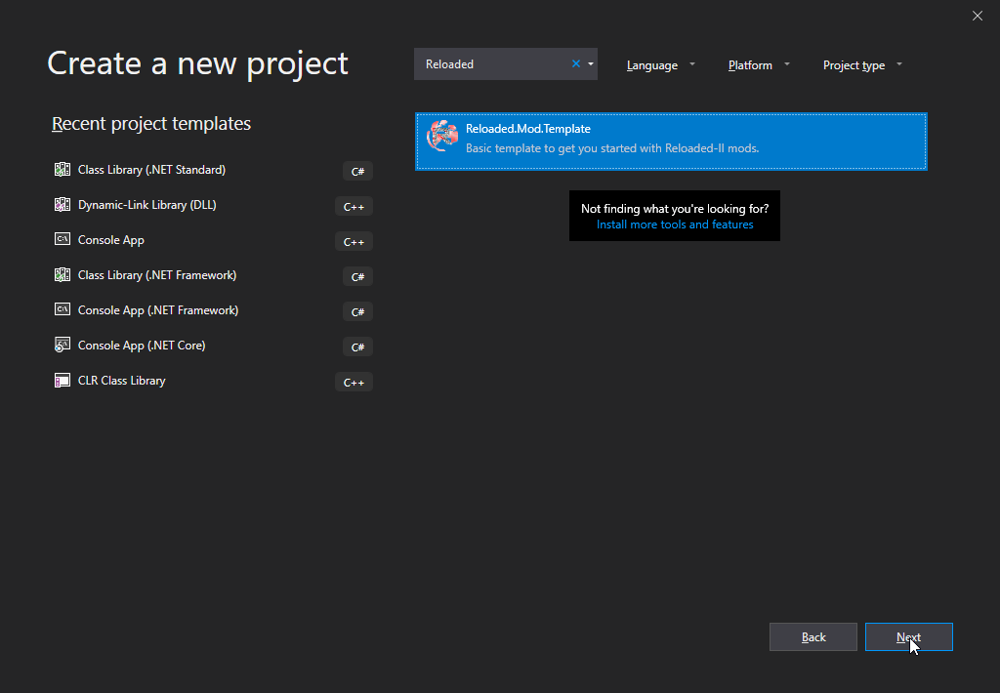

	<h1>Reloaded II: Building Mods</h1>
	
	   
	<strong>Easy as 1,2,3.</strong>
	 
    Steps 4,5 and 6 are boring...
     
    So to bring balance to the universe, I just cut them out.

# Table of Contents
- [Prerequisites](#prerequisites)
- [Creating Project from Template](#creating-project-from-template)
    - [1. Import the Visual Studio Template](#1-import-the-visual-studio-template)
    - [2. Update Mod Configuration and Image](#2-update-mod-configuration-and-image)
    - [3. Debug Your Mods!](#3-debug-your-mods)
- [Other Templates](#other-templates)
- [Creating Project From Scratch](#creating-project-from-scratch)

# Prerequisites

- Visual Studio 2017+
- .NET Core 2.0 SDK (or newer).
- NuGet Package Manager (Fetching Dependencies)

*Basically whatever supports .NET Standard.*

# Creating Project from Template

### 1. Import the Visual Studio Template
The template, named `Reloaded.Mod.Template.zip` can be found in the root of this repository.

To add it to Visual Studio, copy the zip to `C:\Users\[User Name]\Documents\[Visual Studio Version]\Templates\Project Templates`. 

You may now start a new project.

(If the project(s) do not show up, this is a Visual Studio 2019 bug. Close Visual Studio, open the Visual Studio developer command prompt and run `devenv /updateConfiguration`.)

### 2. Update Mod Configuration and Image

Once imported, update the `ModConfig.json` file with the relevant details of your project. You can either edit the `json` file by hand or generate one by creating a new mod in the launcher and copying it over.

Then proceed to replace the mod preview image `Preview.png`.

**Make sure to set ModDll to the file name of your output DLL file**.

### 3. Debug Your Mods!

To debug your mods, by far the best and easiest option is to simply add `Debugger.Launch();` to the start of your program: This will automatically provide you with a prompt to start or use running version of Visual Studio.

From there, simply make a new or choose an existing instance.

# Other Templates
Other templates, e.g. one supporting in-launcher configuration are also available, `Reloaded.Mod.Template.WithConfig.zip`.

# Creating Project From Scratch 

If you would rather not use a template, [here](./ProjectFromScratch.md) is how to recreate the template and create a mod project from scratch.

There is no real benefit to creating a project from scratch, this is provided merely for the curious.
