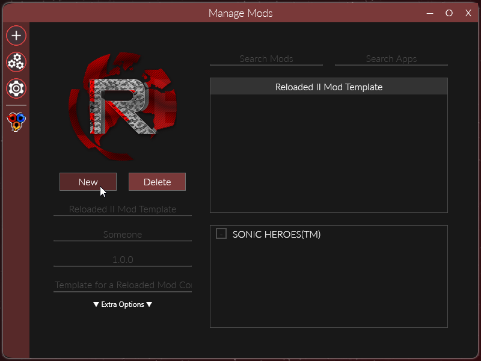
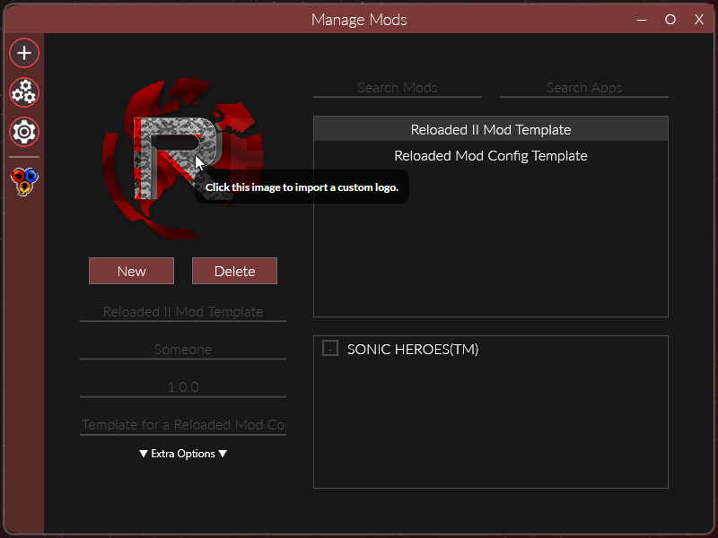

	<h1>Reloaded II: Getting Started w/ Mods</h1>
	
	   
	<strong>Easy as 1,2,3.</strong>
	 
    Steps 4,5 and 6 are boring...
     
    Deja vu! It feels like I've read this piece before!

# Table of Contents

- [Creating A Mod](#creating-a-mod)
    - [1. Create A Configuration File](#1-create-a-configuration-file)
    - [2. Update your Preview Image.](#2-update-your-preview-image)
    - [3. Make it Do Things.](#3-make-it-do-things)

# Creating A Mod

### 1. Create A Configuration File

The first step towards creating a mod is to make a configuration file.
This can be simply done by entering the `Manage Mods` menu and clicking the `New` button.

The configuration file has the following parameters:
**Mod Id**: A name that will uniquely identify the mod.

- **Recommended Format**: "game.type.name"
- **Example**: sonicheroes.asset.seasidehillmidnight
- Including the name of the game is essential as it makes your mod easy to find in the `Download Mods` menu.

**Name:** The name of the mod a seen in the launcher.
**Author**: The name of the author(s) of the mod.
**Version**: The version of the mod. Recommended: [Semantic Versioning](https://semver.org).
**Description**: Short summary of the mod.
**Dependencies**: List of mods that users need enabled use this mod. (Mod loader will auto-enable them).

### 2. Update your Preview Image.
To set the preview image, you can click the `Reloaded` icon above the Mod Id during creation of the mod configuration.

Alternatively, if you ever change your mind after, you can update the image by also clicking it from the `Manage Mods` menu:

To update the preview image, you can either click the mod preview icon or enter the mod directory and replace the image by hand.

At the time of writing, the preview images in Reloaded-II are `256x256` in size.

### 3. Make it Do Things.

By default, Reloaded Mod Loader does not provide any functionality such as e.g. File Redirection that you may have seen or be used to in other mod loaders. To make Reloaded modular, all functionality that affects the target application are implemented as separate mods.

If you're a programmer and wish to implement such mods, please read the [Developer Mod Guide](./DeveloperModGuide.md) and then read [Inter Mod Communication](./InterModCommunication.md).

If you're not a programmer, here is a list of mods providing various functionalities you could use to get started:

- File Redirection: - [Reloaded Universal File Redirector](https://github.com/Reloaded-Project/Reloaded.Mod.Universal.Redirector)

*PS. You should set those as dependencies and include links to in your mod releases.*

